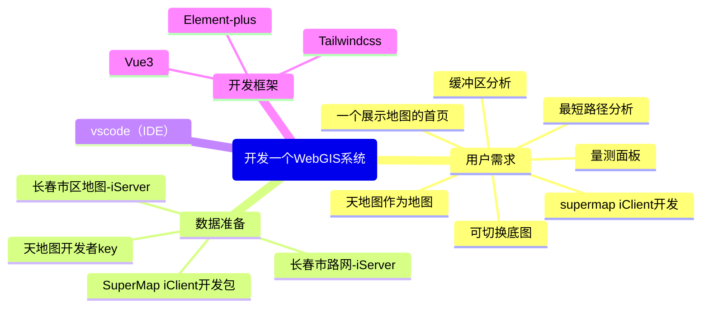
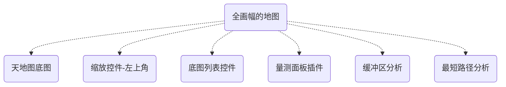

# 准备环节

以上是作为一个开发者在准备环节首先应该考虑的,接下来我们一步一步解离这些构想。
## 数据准备
### 天地图Key
在这里申请--><el-button 
            type="danger"
            tag='a' 
            href="http://lbs.tianditu.gov.cn/server/MapService.html" 
            target="_blank"
            style="color:white;text-decoration:none;">天地图官网</el-button>
### iClient开发包
不赘述，请看之前的章节：[安装iClient依赖](/supermap/env/vue3.html#_2-安装iclient依赖)
### 长春市地图及路网-iServer
这里的数据来源于SuperMap iServer的示例数据，在每一个iServer软件安装时就自带了。
### 开发框架
我非常推荐Vue3，配置已经在前述章节中提到了--> [Vue3基础配置](/supermap/env/vue3.html)
如果你觉得上手难度过大，可以考虑使用原生html、css、js来实现这些功能，这些案例在SuperMap iClient for Leaflet官方开发指南中很容易找到,以下是对应的链接:
- [创建一幅地图](https://iclient.supermap.io/web/introduction/leafletDevelop.html#createMap)
- [缓冲区分析](https://iclient.supermap.io/web/introduction/leafletDevelop.html#bufferAnalystService)
- [最短路径分析](https://iclient.supermap.io/web/introduction/leafletDevelop.html#planningBestPath)

## 功能设计

在下一章节开始，我将带领大家逐步实现这些功能，最后你将看到一个由自己完成的WebGIS系统。