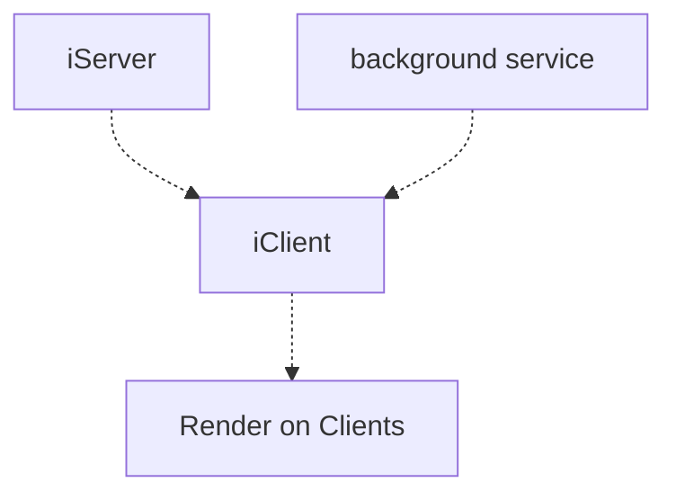

---
layout:doc
---
# SuperMap iServer配置
## 概述
SuperMap iServer 是基于高性能GIS内核的云GIS应用服务器，分为标准版、专业版、高级版三个版本，具有二三维一体化的服务发布、管理与聚合功能，并提供多层次的扩展开发能力，通过提供多种移动端、Web端、PC端等开发SDK，可用于构建SOA应用系统和GIS专有云系统。

简单来说，iServer就是一个后端服务应用，提供一系列GIS特色的接口，在前端的iClient中调用这些接口，实现各种GIS功能。因此这类服务应用也叫GIS服务器。
一般来说，所有的GIS服务器都具有以下功能：
- 地图服务
- 影像服务
- OGC服务
- 空间分析服务
- ...

## 安装iServer
实际上 iServer 就是一个软件，和通常的软件安装并无二致，只是它是一个需要长时间不间断运行的软件。  
下面以windows系统为例安装iServer
### 下载
GIS Server的使用通常伴随着其桌面软件的使用，因此首先需要下载SuperMap iDesktop。(点击图片跳转下载)

接下来，申请试用许可：
[离线试用SuperMap GIS系列软件](https://doc.supermapol.com/zh-hans/TrialLicense/filetrial.html)  

下载 iServer并安装：

同样需要申请该产品的试用许可[离线试用SuperMap GIS系列软件](https://doc.supermapol.com/zh-hans/TrialLicense/filetrial.html)  