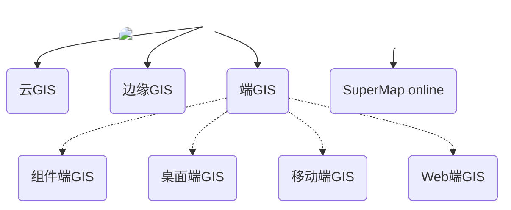

# SuperMap GIS 11i(2023) 简介

超图软件研发的大型 GIS 基础软件系列——SuperMap GIS，是二三维一体化的空间数据采集、存储、管理、分析、处理、制图与可视化的工具软件，更是赋能各行业应用系统的软件开发平台。   
历经二十余年的技术沉淀，超图软件构建了云边端一体化的 SuperMap GIS 产品体系，包含云 GIS 服务器、边缘 GIS 服务器、端 GIS 等多种软件产品，提供离线部署和在线服务 (SuperMap Online) 两种交付方式。  
在 SuperMap GIS 11i(2023) 中，超图软件进一步完善 GIS 基础软件五大技术体系 (BitDC)，即大数据 GIS、人工智能 GIS、新一代三维GIS、分布式 GIS 和跨平台 GIS 技术体系，丰富和革新了 GIS 理论与技术， 赋能各行业信息化。

:::tip
我们主要使用的是iServer和iClient开发包
:::
## 云 GIS 平台软件
SuperMap GIS 产品系列中的云GIS平台软件包括 SuperMap iServer、SuperMap iPortal、SuperMap iManager。

### SuperMap iServer：
基于高性能跨平台 GIS 内核、分布式、可扩展的服务器 GIS 软件开发平台，提供全功能的GIS 服务发布、管理与聚合能力，并支持多层次的扩展开发。提供强大的空间大数据、GeoAI 、空间区块链和三维等相关的 Web 服务，支持海量的矢量、栅格数据“免切片”发布。深度融合微服务、容器化等，提供多种SDK，助力构建微服务架构的云原生GIS 应用系统。

### SuperMap iPortal：
集 GIS 资源整合、搜索、共享和管理于一体的 GIS 门户软件平台，具备零代码快速建站、多源异构服务注册、多源服务权限控制等能力。提供丰富的 Web 端应用，可以进行专题图制作、空间要素编辑、分布式空间分析、三维可视化、大屏创建与展示等操作。作为云边端一体化 GIS 平台的用户中心、资源中心、应用中心，可快速构建 GIS 门户站点。

### SuperMap iManager：
全面的GIS 运维管理中心，可用于应用服务管理、基础设施管理、大数据管理。提供基于容器技术的 Kubernetes 解决方案，可一键创建基于云原生 GIS 技术的大数据、AI 与三维 GIS 系统。可监控多个 GIS 数据存储、计算与服务节点或其它 Web 站点，监控硬件资源占用、地图访问热点、节点健康状态等指标，实现GIS 系统的一体化运维管理。可管理运维GIS 云原生系统，实现细粒度的动态伸缩和灵活部署。
 

## 边缘 GIS 平台软件
### SuperMap iEdge：
GIS 边缘软件平台，部署在靠近客户端或数据源的一侧，实现就近服务发布与实时分析处理，可降低响应延时和带宽消耗，减轻云GIS中心压力。提供高效的服务发布能力，支持海量矢量数据快速发布。
可作为 GIS 云和应用终端间的边缘节点，通过服务代理聚合与缓存加速技术，有效提升云GIS的终端访问体验，并提供智能内容分发和高效边缘分析处理能力，助力搭建更高效智能的云边端一体化的 GIS 应用系统。

## 组件端 GIS
:::details 展开  
### SuperMap iObjects C++ ：

大型全组件式GIS软件开发平台，提供跨平台和二三维一体化能力，适用于 C++ 开发环境。

### SuperMap iObjects Java ：

大型全组件式GIS软件开发平台，提供跨平台、二三维一体化能力，适用于 Java 开发环境。

### SuperMap iObjects .NET ：

大型全组件式GIS软件开发平台，提供二三维一体化能力，适用于 .NET 开发环境。

### SuperMap iObjects Python ：

开箱即用的 GIS 软件开发平台，提供空间数据组织、转换、处理与分析能力，适用于 Python 开发环境。

### SuperMap iObjects for Spark ：

基于分布式技术的大数据 GIS 软件开发组件，提供丰富的大数据分布式管理与分析功能，适用于 Spark 架构的计算和开发环境。

### SuperMap iObjects for Blockchain

基于分布式技术的空间区块链 GIS 软件开发组件，提供空间数据上链、链上管理功能，适用于 Fabric 架构的计算和开发环境。

### SuperMap Scene SDKs for game engines

基于新一代三维 GIS 技术与 Unreal Engine、Unity 两款游戏引擎深度融合的可编程、可扩展、可定制的开发平台，支持多种海量 GIS 空间数据的本地、在线浏览，支持量算、三维空间分析、三维空间查询等 GIS 功能，提供炫酷、实用的效果和应用体验，支持数字孪生、智慧城市等行业应用系统快速定制开发。
:::
## 桌面端 GIS
### SuperMap iDesktop：

桌面GIS软件平台，具备二三维一体化的数据管理与处理、编辑、制图、分析、二三维标绘等功能，支持海图， 支持在线地图服务访问及云端资源协同共享，可用于空间数据的生产、加工、分析和行业应用系统快速定制开发。

### SuperMap iDesktopX：

桌面 GIS软件平台，支持 Windows、Linux 等主流操作系统，原生支持全国产化软硬件环境，突破了专业桌面 GIS 软件只能运行于 Windows 的困境。

提供空间数据生产及加工、分布式数据管理与分析、地图制图、服务发布、处理自动化、机器学习、视频地图等功能，用于数据生产、加工、处理、分析及制图。

## Web 端 GIS
### SuperMap iClient JavaScript：

GIS 网络客户端开发平台，基于现代 Web 技术栈构建，是 SuperMap GIS  和在线 GIS 平台系列产品的统一 JavaScript 客户端。

### SuperMap iClient3D for WebGL：

基于 WebGL 技术实现的三维客户端开发平台，可用于构建无插件、跨操作系统、跨浏览器的三维 GIS  应用程序。

## 移动端 GIS
### SuperMap iMobile for Android / iOS：

专业级全功能移动 GIS SDK，支持二维和三维应用开发，支持在线应用，支持功能离线应用。

### SuperMap iTablet for Android / iOS：

全功能移动 GIS APP，基于 SuperMap iMobile 开发，支持指划制图，模板化数据采集、数据分析、三维数据展示，同时也具备室内外一体化导航、目标识别检测等能力，支持扩展开发，可用于行业应用系统快速定制开发。

### SuperMap ARSurvey for Android / iOS：

以 AR 为主的轻量级移动 GIS APP，基于 SuperMap iMobile for RN 框架开发，支持 AR 实景量算、AR 数据采集、AR 地图制作、同时也具备 AR 定位、导航、分析等能力，可用于室内外高精度数据采集、AR 实景浏览、导航等应用。可在苹果 App Store、华为应用市场、小米应用市场等各大应用市场下载获取。
## 在线 GIS 平台
### SuperMap Online：

超图在线 GIS 平台（[http://support.supermap.com.cn:8090/iserver/](http://support.supermap.com.cn:8090/iserver/)）帮助公有云用户和开发者实现 GIS 数据的安全上云，提供丰富的工具对数据进行在线展示和分析，同时提供多种类型 SDK 以访问使用 GIS 数据，快捷开发业务系统。
