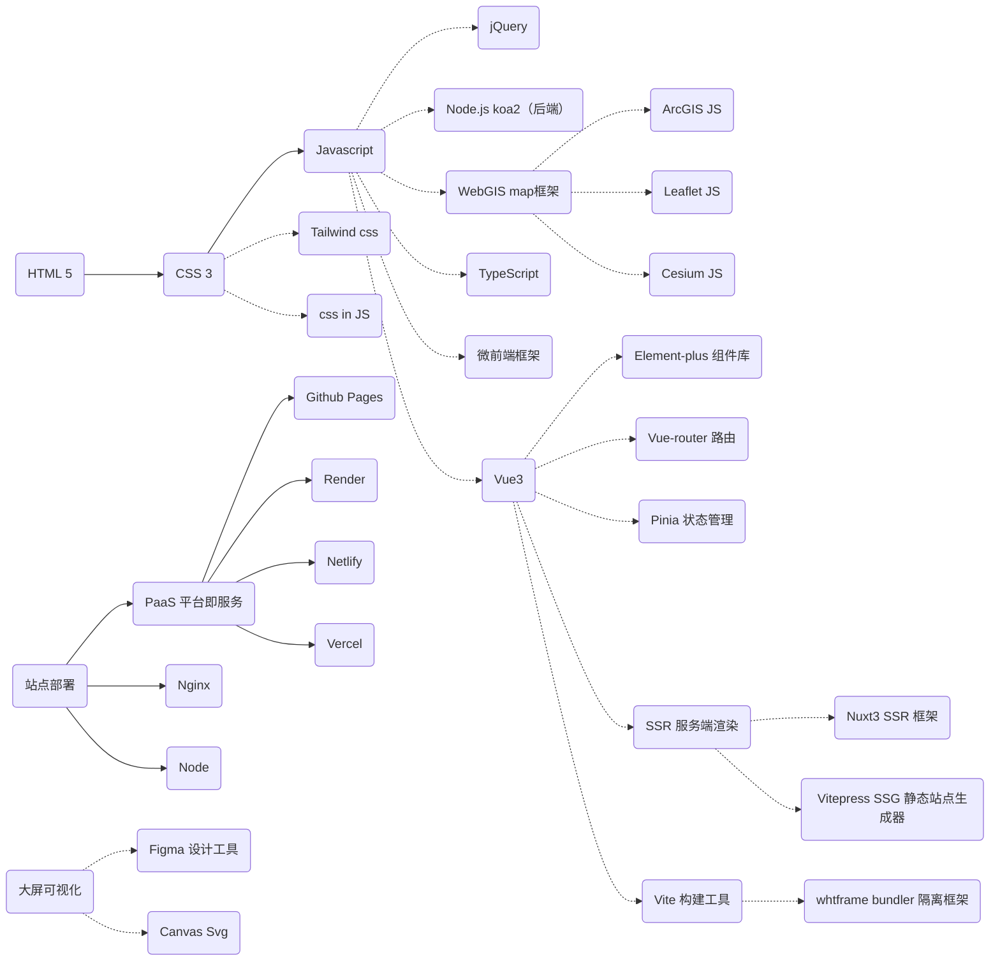

# vue3介绍
本页面是对Vue3官方文档的概括，想要掌握Vue3这个框架，需要首先熟悉`Javascript,html,css,ajax请求`等知识，并且充分阅读[Vue3官方文档](https://cn.vuejs.org/guide/introduction.html)。

## 笔者使用总结
笔者的前端学习路线大概可以描述如下：

从学习经历来看，大部分时间都用在了理解和运用JS上，与同学们现有的认知：做网页会HTML就行相差甚远。框架选择vue一方面是因为其上手相对简单，生态也完善；另一方面也是因为笔者当时迫切的需要选择一个框架来支撑复杂的项目，后来发现Vue3越用越好用，于是不断的在引入其相关工具链使用，包括本站也是由Vitepress+vue3+vite构建的。
## 什么是 Vue？​
**Vue** (发音为 /vjuː/，类似 view) 是一款用于构建用户界面的 JavaScript 框架。它基于标准 HTML、CSS 和 JavaScript 构建，并提供了一套声明式的、组件化的编程模型，帮助你高效地开发用户界面。无论是简单还是复杂的界面，Vue 都可以胜任。

下面是一个最基本的示例：

```js
import { createApp, ref } from 'vue'

createApp({
  setup() {
    return {
      count: ref(0)
    }
  }
}).mount('#app')
```
```html
<!-- tip:原文档的右上代码标识为template,以原文档为准 -->
<div id="app">
  <button @click="count++">
    Count is: {{ count }}
  </button>
</div>
```
结果展示(请尝试点击按钮):
<script setup lang="ts">
import {ref} from 'vue';
import {ElButton} from 'element-plus';
const count = ref(1);
</script>
<div class=" h-14 w-40 ">
  <el-button @click="count++" class="shadow-xl " type="success">
Count is:&ensp;&ensp;&ensp; <strong>{{ count }}</strong>
  </el-button>
</div>

上面的示例展示了 Vue 的两个核心功能：

- 声明式渲染：Vue 基于标准 HTML 拓展了一套模板语法，使得我们可以声明式地描述最终输出的 HTML 和 JavaScript 状态之间的关系。

- 响应性：Vue 会自动跟踪 JavaScript 状态并在其发生变化时响应式地更新 DOM。

:::info
你可以看到，当我们点击按钮时，数字在增长，这就是vue的响应式,声明式渲染很好理解，像html这样写标签的代码就是声明式，像写配置文件一样的。而像写C语言、Javascript代码这样的，就是编程式。  
当然，如果你了解一点vue3的基础使用，你应该会发现，结果展示的效果和源代码产生的效果不一样，这是因为在文档中，为了方面大家理解，笔者做了美化处理，这其中就涉及到了vue3的生态应用，这将在后续中介绍。
:::
## 起步
> 笔者认为:前端项目开始最艰难的阶段其实是搭建一个兼容性良好的开发环境。针对单纯的vue项目，即不引入复杂的第三方库的情况下，可以采用以下方式：
### 1. 安装vscode及插件
前端开发一般使用webstorm、vscode，笔者这里推荐vscode，因为vscode的插件生态十分丰富。
:::tip
vscode的安装这里就不做赘述了，网上教程很多。  
需要注意的是，vscode ≠ visual studio

<div class="flex flex-row gap-2">
  
  
  
</div>
vscode是开源代码编辑器，visual studio是闭源的集成开发环境。相比于visual studio，vscode更轻量，掌控度高，而且vscode的插件生态十分丰富。
:::
必要插件：
- Vue Language Features (Volar)
- Vite
- Tailwind CSS IntelliSense

可选：
- Vue3 Snippets
- Tailwind Fold
- TypeScript Vue Plugin(Volar)

### 2. 安装node.js
node.js的安装这里也不做赘述了，网上教程很多。  
> `注意安装18以上的版本`

node常用的包管理器是npm,下面介绍node和npm常用的命令(不要带上开头的>符号)。
```powershell 
> node --version // 检查node版本
> npm install <pakages>//安装各种包
> npm uninstall <pakages>//卸载各种包
> npm run <custom code>//运行自定义命令，定义在package.json中的scripts字段中
```

## 安装Vue3
实际上这一步查看[Vue3官方文档 | 快速上手](https://cn.vuejs.org/guide/quick-start.html)更为有效,这里仅演示笔者通常的做法。
确保你安装了node.js，安装node.js时会自动安装npm，npm是node.js的包管理器,并且你的当前目录正是打算创建项目的目录。在命令行中执行以下命令(不要带上>符号):
```cmd
> npm create vue@latest
```
这一指令将会安装并执行**create-vue**,它是Vue官方的项目脚手架工具。你将会看到一些诸如TypeScript和测试支持之类的可选功能提示：
```cmd
✔ Project name: … <your-project-name>
✔ Add TypeScript? … No / Yes
✔ Add JSX Support? … No / Yes
✔ Add Vue Router for Single Page Application development? … No / Yes
✔ Add Pinia for state management? … No / Yes
✔ Add Vitest for Unit testing? … No / Yes
✔ Add an End-to-End Testing Solution? … No / Cypress / Playwright
✔ Add ESLint for code quality? … No / Yes
✔ Add Prettier for code formatting? … No / Yes

Scaffolding project in ./<your-project-name>...
Done.
```
如果不确定是否要开启某个功能，你可以直接按下回车键选择 No。在项目被创建后，通过以下步骤安装依赖并启动开发服务器：
```cmd
> cd <your-project-name>
> npm install
> npm run dev
```
这三个命令十分重要，**日常使用的频率很高**。我将逐行讲解：
```cmd{1}
> cd <your-project-name>// [!code focus]
> npm install 
> npm run dev
```

这里的`<your-project-name>`是项目名称
```cmd{2}
> cd <your-project-name>
> npm install //[!code focus ] 
> npm run dev
```
这里的`npm install` 是在执行包安装任务
```cmd{3}
> cd <your-project-name>
> npm install
> npm run dev //[!code focus]
```
这里的`npm run dev`是在执行开发环境的项目启动。

你现在应该已经运行起来了你的第一个 Vue 项目！请注意，生成的项目中的示例组件使用的是**组合式 API** 和 **\<script setup\>**，而非选项式 API。下面是一些补充提示：

推荐的 IDE 配置是 [Visual Studio Code](https://code.visualstudio.com) + [Volar](https://marketplace.visualstudio.com/items?itemName=Vue.volar) 扩展。如果使用其他编辑器，参考 [IDE 支持章节](https://cn.vuejs.org/guide/scaling-up/tooling.html#ide-support)。  
更多工具细节，包括与后端框架的整合，vue官方在[工具链指南](https://cn.vuejs.org/guide/scaling-up/tooling.html)进行讨论。  
要了解构建工具 Vite 更多背后的细节，请查看 [Vite 文档](https://cn.vitejs.dev)。  
如果你选择使用 TypeScript，请阅读 [TypeScript 使用指南](https://cn.vuejs.org/guide/typescript/overview.html)。  
当你准备将应用发布到生产环境时，请运行：  
```cmd
> npm run build  
```

此命令会在 ./dist 文件夹中为你的应用创建一个生产环境的构建版本。关于将应用上线生产环境的更多内容，请阅读[生产环境部署指南](https://cn.vuejs.org/guide/best-practices/production-deployment.html)。
## 项目结构
:::tip
这里指的项目结构即是相对于你的项目根目录的文件夹/文件的结构。
:::
使用`npm create vue@latest`时会自动创建一些基本的目录结构,在实际的简单开发中使用这样的结构足够了，但是当项目复杂起来时，就需要对目录结构进行调整，以方便管理。
下面是网上转载的一个目录结构，设计的层级比较丰富，实际可以根据需要增删，仅供参考：
```sh
├── public/                             # 静态资源目录
├── src/
│   ├── assets/                         # 全局资源目录
│   │   ├── fonts/
│   │   └── images/
│   │
│   ├── components/                     # 全局组件
│   │   └── UserSelectTable/
│   │       ├── style/
│   │       │   ├── _var.scss
│   │       │   └── index.scss
│   │       ├── UserSelectTable.vue
│   │       └── index.js
│   │
│   ├── layouts/                         # 自定义布局目录，可以写一个 ProLayout 代替自定义布局
│   │   ├── Basic.vue
│   │   └── User.vue
│   │
│   ├── mocks/                           # 本地模拟数据
│   │   ├── data/
│   │   ├── setup.mock.js
│   │   └── users.mock.js
│   │
│   ├── store/                           # 状态管理
│   │   ├── plugins/
│   │   │   ├── persist.js
│   │   │   └── qiankun.js
│   │   ├── modules/                     # 除非业务过于复杂，否者不推荐
│   │   │   ├── cart.js
│   │   │   └── products.js
│   │   ├── getters.js                   # 根级别的 getters
│   │   ├── actions.js                   # 根级别的 action
│   │   ├── mutations.js                 # 根级别的 mutation
│   │   └── index.js
│   │
│   ├── router/
│   │   ├── routes.js                   # 路由配置
│   │   └── index.js
│   │
│   ├── services/                       # 全局数据请求
│   │
│   ├── views/                          # 页面级组件
│   │   ├── Home/
│   │   │   ├── components/             # 页面级组件
│   │   │   ├── services/               # 页面级组数据请求
│   │   │   │   └── repo.js
│   │   │   └── Home.vue
│   │   │
│   │   └── About/
│   │       ├── components/
│   │       └──  About.vue
│   │
│   ├── login.js                        # 登录页入口
│   └── main.js                         # 应用入口
│
├── .browserslistrc
├── .env
├── .editorconfig
├── .eslintrc.js
├── .prettierrc
├── babel.config.js
├── vue.config.js
├── LICENSE.md
├── jsconfig.json
└── package.json

```
## 写在最后
用Vue3开发项目，需要重点学习的知识：
1. Vue3 组合式 API
Vue2主要是通过选项API来开发，Vue3中，使用组合式API来开发，可以更加高效，更加灵活。以下是二者的对比图：

`Vue3/Vue2选项式API`  

`Vue3组合式API`  
使用组合式API，更像传统的JS代码，更具有逻辑，而不是写配置一样。
2. Vue3 响应式系统
Vue2/3都具有响应式系统，但实现方式和性能不同。  
响应式意味着数据驱动模型, 数据变化时，视图会自动更新。  
3. Vue3 生命周期
:::danger 非常重要
熟悉Vue3的生命周期，尤其是对于WebGIS的开发，装载地图对象都需要在onMounted钩子函数中进行。
:::
4.熟练使用Vue3生态里的各种工具链
:::warning 提醒
单纯的Vue并不能为你的Web应用带来多大的效益，反而会觉得可有可无，一旦引入Vue生态内的各种工具，则会使你的开发效率和代码质量得到很大的提升。
例如：
- 组件库：Element-plus | Antd vue
- CSS库：TailwindCSS | UnoCSS
- 状态管理：Pinia
- 路由：Vue-Router
- SSR：Vite 
- 服务端渲染：Nuxt3
:::
**要想用vue进行正常的开发，还需要仔细阅读[Vue3官方文档](https://cn.vuejs.org/guide/introduction.html)。这里只是抛砖引玉，希望能对大家有所帮助。**
